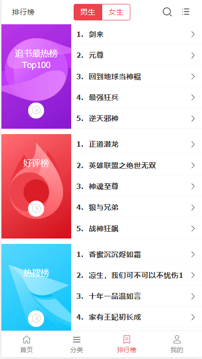
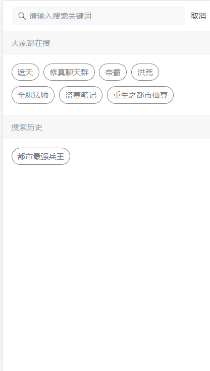
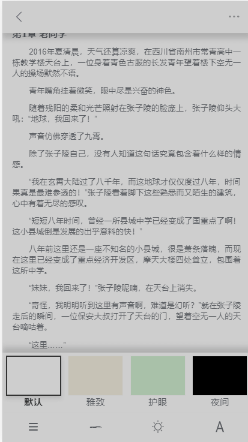
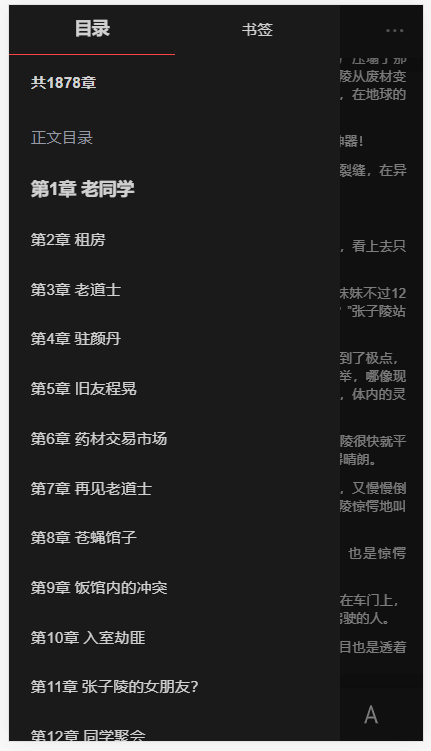
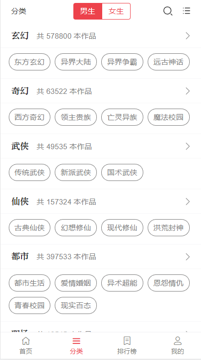

# vue-ssr-book

> 一个基于 **<abbr title="Hyper Text Markup Language">nuxt2.8 + koa2 + mongodb + vant </abbr>** 的SSR在线阅读webapp网站,访问环境 http://101.132.188.203:3001

## 声明
>目前代码项目还在不断完善中，本项目所用到的ui组件是[有赞](https://github.com/youzan/vant)，参考ui是[起点阅读](https://m.qidian.com)，api接口是[追书神器](https://github.com/zimplexing/vue-nReader/blob/master/doc/zhuishushenqi.md)，实现SSR服务端渲染，后续代码会慢慢更新，欢迎交流，欢迎Issues。

## 技术栈

> **nuxt2.8+vuex+better-scroll+sass+localStorage+koa2+mongoose+vant**


## 项目说明

项目运行需要安装 **<abbr title="Hyper Text Markup Language">Mongodb</abbr>** 数据库，注册登录会用到，
项目中用 **<abbr title="Hyper Text Markup Language">vuex</abbr>** 做了大量数据缓存，提升页面加载速度
项目过程中采了不少坑,如有疑问，尽可留言交流

## 运行项目步骤：

##### 1：请确保node版本在8以上，本地安装好mongodb数据库并且打开连接

##### 2：进入根目录，在此目录下打开cmd窗口运行 npm i 安装依赖,然后 npm run dev 启动本地服务,打开http://localhost:3001  

## 页面
- [x] 首页 / 男女频道
- [x] 搜索页面和搜索详情页
- [x] 图书分类
- [x] 排行榜 / 排行榜详情
- [x] 登录 / 注册
- [x] 个人中心
- [x] 阅读页面
- [x] 书籍详情
- [x] 书籍目录
- [x] 书籍评论

# 实现功能
- [x] 首页男女频道切换展示
- [x] 搜索 / 模糊搜索 / 搜索历史（本地缓存）
- [x] 书籍详情 
- [x] 书籍目录
- [x] 书籍评论
- [x] 加入我的书架，实时同步阅读进度(需要登录)
- [x] 向左滑动删除我的书架书籍，实时同步阅读进度(需要登录)
- [x] 阅读页面字体大小切换
- [x] 阅读页面字体主题切换
- [x] 阅读页面阅读目录切换 ，上一章，下一章....
- [x] 书籍列表，vant的骨架屏
- [x] 登录 / 退出登录
- [x] 阅读进度条
- [x] ......
- [ ] 书签
- [ ] 阅读历史本地缓存
- [ ] 书籍左右翻页


## 项目截图











### 关于请求接口跨域问题，
```js
> 在目录下的nuxt.config.js文件下面的里加上这样一段代码，既可跨域,只适用于开发环境


proxy: {
    '/zhuishu': {
        target: 'http://api.zhuishushenqi.com',
        ws: true,
        changeOrigin: true,  //是否跨域
        pathRewrite: {
            '^/zhuishu': ''
        }
    }
}

> 请求接口时这样写
newDetails(id) {
     axios.get(`/zhuishu/details`)
	 ....
}
```